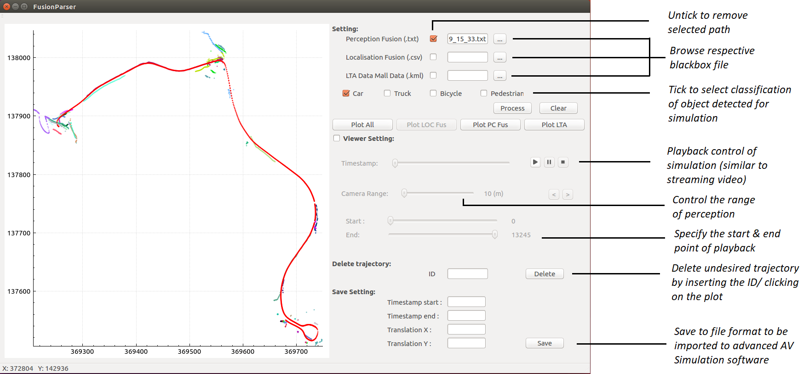
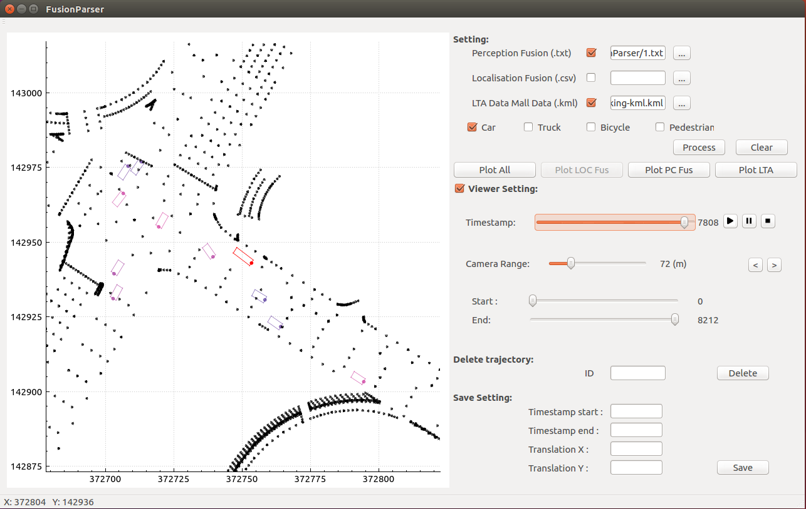

# **Fusion Parser for black box data visualization**

*Fig 0: Breakdown of Fusion Parser tool’s function*

## Objective
This tool serves as a visualisation tool for autonomous vehicle's black box data. It takes in 3 types of input data - Perception Fusion log file, Localization Fusion log file and/or LTA Data Mall file. 

By timesyncing perception fusion and localization fusion log file, the detected traffic can be simulated and traffic flow during mission can be reformed. LTA Data Mall provides lane kerb information and it is used to represent the road network.

While it is true that it can serve as a 2D black box simulation tool, the main purpose of this tool is to filter and select relevant targets' paths to be imported into a higher fidelity 3D Simulation tool such as *VIRES VTD* and *PreScan*, to further validate the strengths and weaknesses of a self-driving algorithm.

*Fig 1: A single frame showing the vehicles perceived and recorded by the AV’s software, with extra visualisation of road information from LTA’s road data.*

## Required parameters 

1. Perception Fusion log
>  - timestamp
>  - ego's position, x
>  - ego's position, y
>  - target's position, x
>  - target's position, y
>  - target's heading, phi
>  - target's classification
>
2. Localization Fusion log
>  - timestamp
>  - ego's position, x
>  - ego's position, y

3. LTA Data Mall
>  - [LTA Kerb Line in KML format](https://data.gov.sg/dataset/lta-kerb-line)

## Dependencies
#### Tested on Ubuntu 16.04 & 18.04

- Qt >= v4.0

## Basic Build Instructions

1. Clone this repo
2. Open FusionParser.pro with Qt Creator 
3. Build the package

